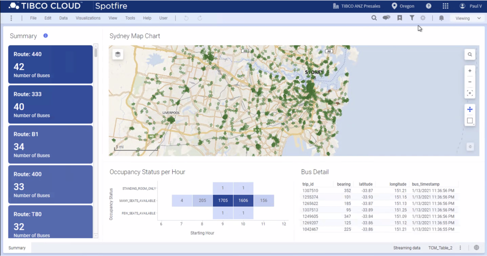
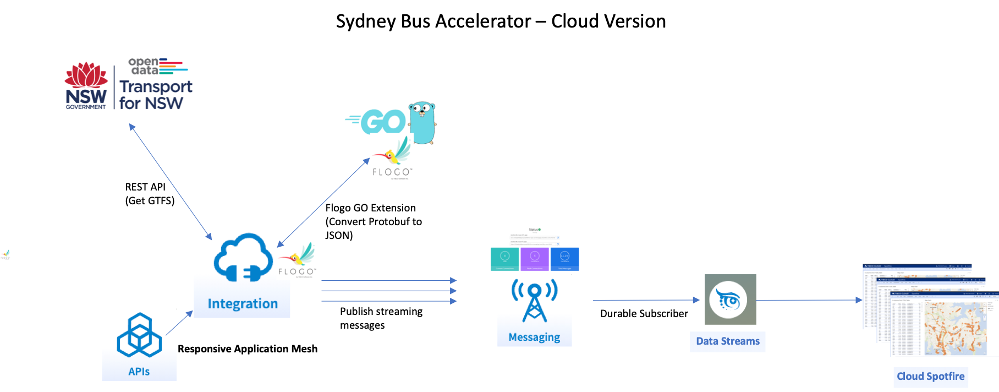
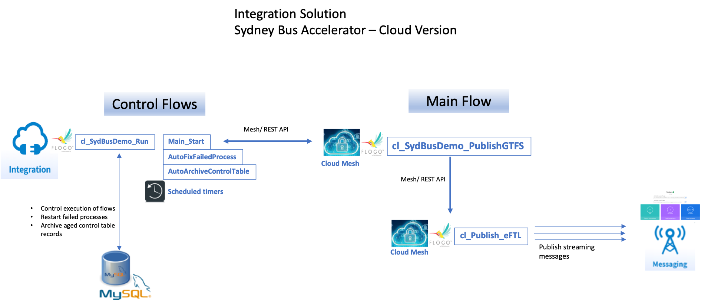
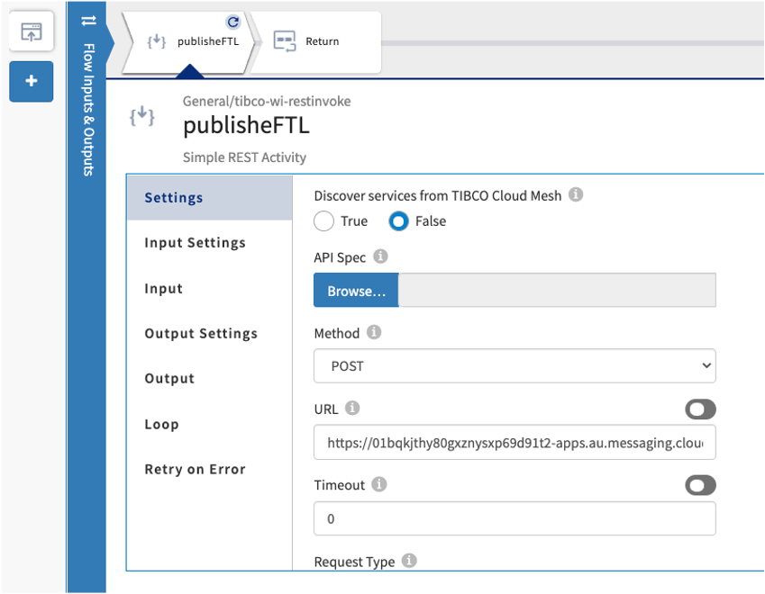
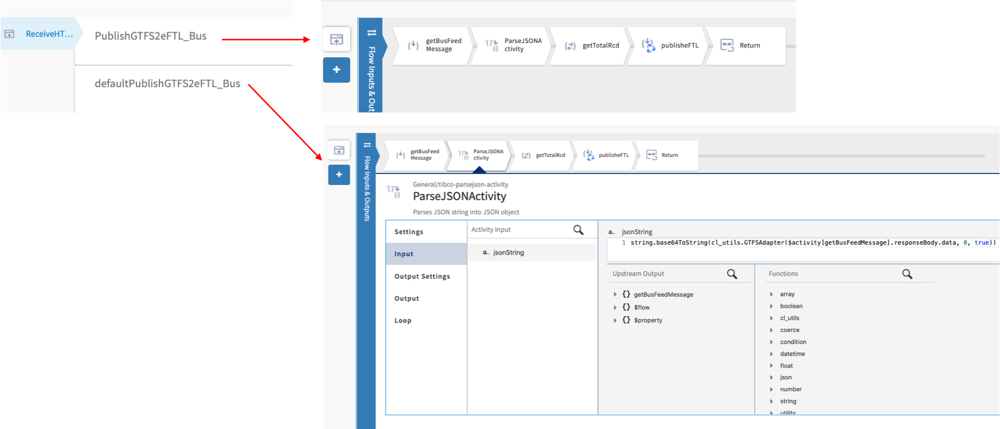
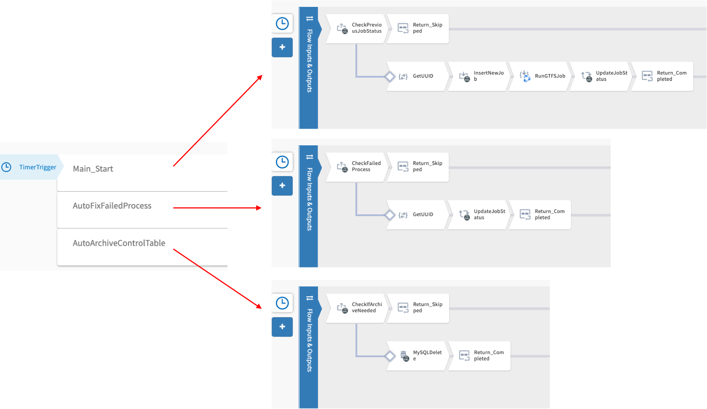
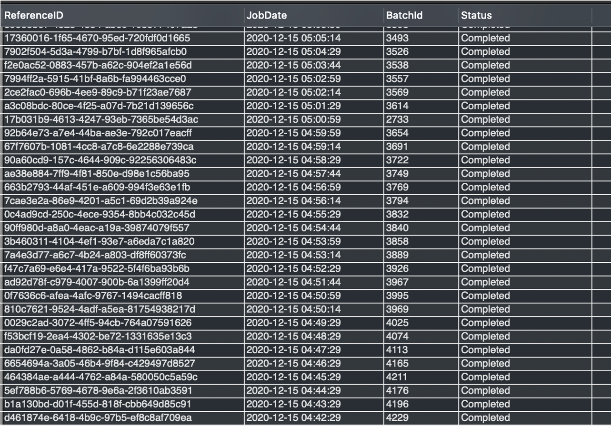
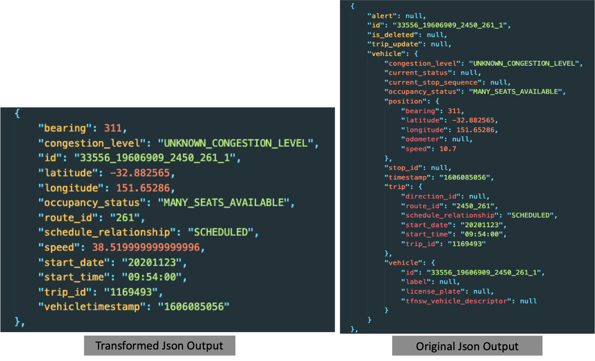

TIBCO ANZ Solution Engineering

Date: December 2020

Salck Channel: #anz-accelerator-realtime-public-transport-cloud

# Real-Time Public Transport Accelerator (Cloud Version)

Transport for NSW (TfNSW) is the government owned institution responsible for the public transport network in New South Wales, Australia, including buses, trains, light rails, metro, ferries and so on. This accelerator demonstrates end-to-end real-time data integration with open source custom extension, messaging, streaming and visual analytics features using TIBCO's Connect and Predict capabilities using real time GTFS feeds provided by TfNSW’s Open Data Hub data services.

Initial phase:
Using TIBCO Develop (Flogo) to extract, transform real time GTFS feeds from Transport for NSW's Open Data Hub data services and publish the streaming data in JSON format to TIBCO Cloud Messaging eFTL service (TCM-eFTL). TIBCO Cloud Data Streaming service subscribed to the TCM eFTL service provides live streaming data to TIBCO Spotfire to generate visual analytics.

# TIBCO Products
The following products were used to build this Accelerator: 
  - TIBCO Cloud Integration (TCI)
  - TIBCO Cloud Messaging eFTL (TCM)
  - TIBCO Cloud Data Stream (TCDS)
  - TIBCO Spotfire
  - In addition, a custom extension based on an open source platform (GO) was built to provide message conversion, transformation and other supporting features.

# Solution and Design Details

## Solution Overview
Components Diagram - Version 1

Incorporating the modern application architecture as described by Responsive Application Mesh (RAM), a number of key Connect capabilities will be used in this demo. Getting the real time GTFS data feed, converting them to streaming messages and publishing each message to TCM eFTL are managed by a collection of TCI Develop flows. The current solution utilises the following components:

  - **Custom Flogo Extension**
    - using open source to covert protobuf to JSON format
  - **TIBCO Cloud Integration (TCI) Develop Apps**:
    - cl_Publish_eFTL (Cloud Mesh)
      - Publish feed message to eFTL server - Discoverable via Cloud Mesh to publish a streaming message to TCM eFTL server.
    - cl_SydBusDemo_PublishGTFS (Cloud Mesh)
      - Get GTFS feeds from TfNSW datahub, transform and publish - Discoverable via Cloud Mesh to get GTFS feed from TfNSW's Open Data service and run the required tasks to convert, transform and split the GTFS feed to individual streaming messages for each entity contained in the feed. Each message will be published to TCM eFTL via Publish to eFTL app.
    - cl_SydBusDemo_Run
      - Manage and Run GTFS - Consists of all the supporting flows to  run cl_SydBusDemo_PublishGTF flow, fix failed processes and archive control table logs.
  - **TCM eFTL Cloud server (TCM-eFTL)**
    - Responsible for managing the messages between publisher and subscribers.
  - **TIBCO Cloud Data Streams (TCDS)**
    - Configured as a durable subscriber to TCM-eFTL and stream the received messages to Spotfire dashboards using this connection.
  - **TIBCO Cloud Spotfire (TCS)**
    - Provide visualization and analytics to the GTFS data feed.

Subsequent enhancements may also include using **TIBCO Cloud Event (TCE)** to generate real time alerts and **TIBCO Live Apps** for case management.

## Integration Overview   
Deep dive into the integration solution

This demo is supported by three integration apps developed in Flogo:
  - **cl_Publish_eFTL**:
    - This app is discoverable via Cloud Mesh to publish a streaming message to TCM eFTL server via REST API.

  - **cl_SydBusDemo_PublishGTFS**: 
    - This app is discoverable via Cloud Mesh to get GTFS feed from TfNSW's Open Data service and run the required tasks to convert, transform and split the GTFS feed to individual streaming messages for each entity contained in the feed. Each message will be published to TCM eFTL via Publish to eFTL app.

  - **cl_SydBusDemo_Run**:
    - This app consists of the supporting flows to run Publish GTFS app, fix failed processes and archive control table logs.

**Control Table**:

The size of the GTFS message for Sydney Bus is based on the number of active buses running at the time of the day. During peak hours, it could have more than 4000 active buses running in the Sydney metropolitan area. The purpose of the control table is to optimise, tune and manage the execution of main flow which gets GTFS feeds and publishes the streaming messages to the eFTL server. 

The control table consists of
  - ReferenceID (generated UUID)
  - JobDate (Datetime the job started)
  - Batchid (Number of entities, i.e. active buses, in the GTFS bus feed)
  - Status (Started, Completed)

An example of GTFSBusPosCtrl table data:

## Flogo Extension(using open source)

Flogo function GTFSAdapter was built using GO language as an extension to process the required message conversion, transformation and other supporting features including:
  - Base64 encoding and decoding
  - Converting protobuf message to JSON format
  - Transforming and generating the output data
  - Data cleansing and exceptions handling for bad data 
  - Providing parameters to specify default entity size and custom transformation mapping (future releases) for testing and tuning for publishing to TCM.

***Function Description:***
Custom extension function to convert GTFS transport protobuf message to Json format containing an array of GTFS entities only without the header.

****Usage:****
  - GTSFSAdapter(ProtobufMessage(string), EntitySize(int), Transform(bool))

****Parameters:****
1). ProtobufMessage
The protobuf message to be converted to Json

2). EntitySize
The total number of entities will be returned in the Json string by the function

(n = actual number of entity in the message)

  - When EntitySize <= 0, return all entities in the message (i.e. n)
  - When EntitySize > 0 and < n, return the number of entity specified in this parameter
  - When EntitySize >= n, return all entities in the message (i.e. n)

3). Transform
  - When true, the Json output will contain the transformed entities (currently the transformation output structure is hard-coded)
  - When false, the Json output will contain the orginal structure of the entities

****For Example,****
  - GTSFSAdapter(Protobuf_message, 25, false)

Which will process the first 25 entities of the message without transformation and return the Json string output.

## TIBCO Cloud Data Streams
Now that we have our data in the messaging layer (TIBCO Cloud Messaging) we can start working on one of the downstream applications that can leverage this data. One of these applications is the streaming analytics application which we are going to build using TIBCO Cloud Data Streams and TIBCO Cloud Spotfire.

TIBCO Cloud Data Streams brings the power of real-time analytics to the cloud. It is TIBCO's zero-install, browser-based, cloud-based, wizard-driven, real-time streaming business intelligence (BI) platform. It can source data from different messaging technologies which include Apache Kafka, MQTT, and TIBCO Cloud Messaging. The connection wizard will automatically discover all the topics on the given messaging bus and present you with options to choose from in the form of a list. After you define the topics and schema, it creates a live data table.

## TIBCO Cloud Spotfire
This data table can be connected seamlessly to Spotfire analytics to create visualisations. In TIBCO Cloud Spotfire, you can view this data stream alongside historical data or other streaming data, create aggregations, and even apply data science.

License
----
MIT
