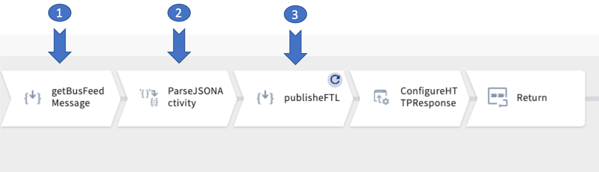

TIBCO ANZ Solution Engineering

Date: December 2020

# Real-Time Sydney Bus Accelerator
Transport for NSW (TfNSW) is the government owned institution responsible for the public transport network in New South Wales, Australia, including buses, trains, light rails, metro, ferries and so on. This accelerator demonstrates end-to-end real-time data integration with open source custom extension, messaging, streaming and visual analytics features using TIBCO's Connect and Predict capabilities using real time GTFS feeds provided by TfNSW’s Open Data Hub data services.

Initial Scope:
Using TIBCO Develop (Flogo) to extract, transform real time GTFS feeds from Transport for NSW's Open Data Hub data services and publish the streaming data in json format to TIBCO Cloud Messaging eFTL service (TCM).
TIBCO Cloud Data Streaming service subscribed to the TCM eFTL service provides live streaming data to TIBCO Spotfire to generate visual analytics.

# TIBCO Products
The following products were used to build this Accelerator: 
  - TIBCO Cloud Integration (TCI)
  - TIBCO Cloud Messaging eFTL (TCM)
  - TIBCO Cloud Data Stream (TCDS)
  - TIBCO Spotfire
  - In addition, custom extension based on open source platform (GO) was built to provide message conversion, transformation and other supporting features.

# Solution and Design Details
**Flogo Extension(using open source)**

Flogo function GTFSAdapter was built using GO language as an extension to process the required message covnersion, transformation and other supporting features including:
  - Base64 encoding and decoding
  - Converting protobuf message to JSON format
  - Transforming and generating the output data
  - Data cleansing and exceptions handling for bad data 
  - Providing parameters to specify default entity size and custom transformation mapping (future releases) for testing and tuning for publishing to TCM.

***Function Description:***

Custom extension function to convert GTFS transport protobuf message to Json format containing an array of entities only (without the header).

****Usage:****

  - GTSFSAdapter(ProtobufMessage(string), EntitySize(int), Transform(bool))

****Parameters:****

1). ProtobufMessage

The protobuf message to be converted to Json

2). EntitySize

The total number of entities will be returned in the Json string by the function

(n = actual number of entity in the message)

  - When EntitySize <= 0, return all entities in the message (i.e. n)
  - When EntitySize > 0 and < n, return the number of entity specified in this parameter
  - When EntitySize >= n, return all entities in the message (i.e. n)

3). Transform

  - When true, the Json output will contain the transformed entities (currently the transformation structure is hard coded)
  - When false, the Json output will contain the orginal structure of the entities

****For example,****

  - GTSFSAdapter(Protobuf_message, 25, false)

Which will process the first 25 entities of the message without transformation and return the Json string output.

**Integration Flow**

The integration flow contains three key activities as depicted in the diagram:
 1. getBusFeedMessage
    - RESTful API call to the Transport for New South Wales's bus position data service.
    - Returning base64 encoded message containing header and an array of active buses and their real time geo-position details in protobuf format.
 2. ParseJSONActivity
    - Applying the tfNSW_protobuf2JSON function to the protobuf message received from getBusFeedMessage step to generate a JSON object which contains an array of entities.
 3. publisheFTL
    - Creating an **iterator** by applying the JSON object from the ParseJSONActivity step.
    - For each instance of the **iterator**, publish the message to the eFTL
  
  

**DataStream Connection**

**Spotfire Analytics**

### Todos
    - Add custom transformation mapping features
    - Support different types of TfNSW message services

License
----
MIT
