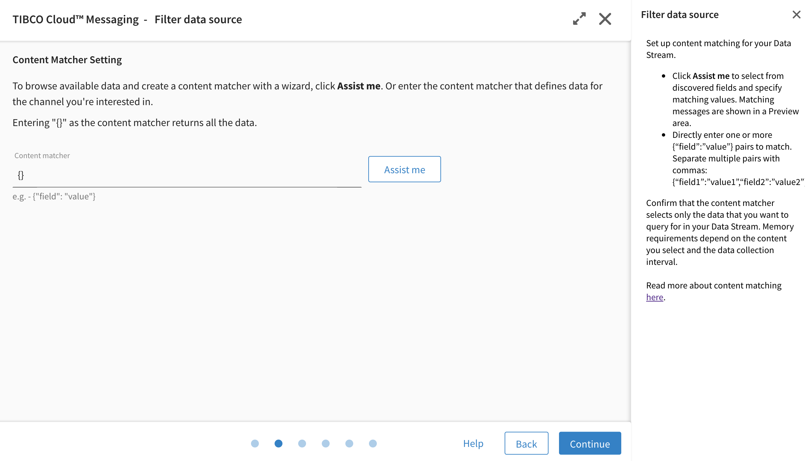
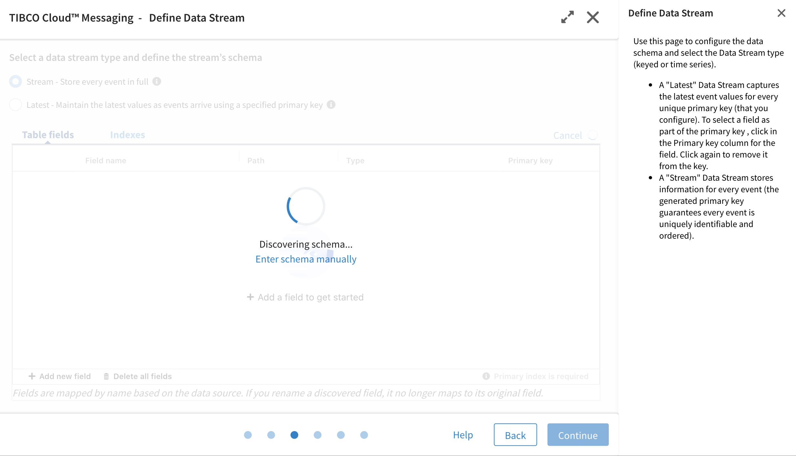
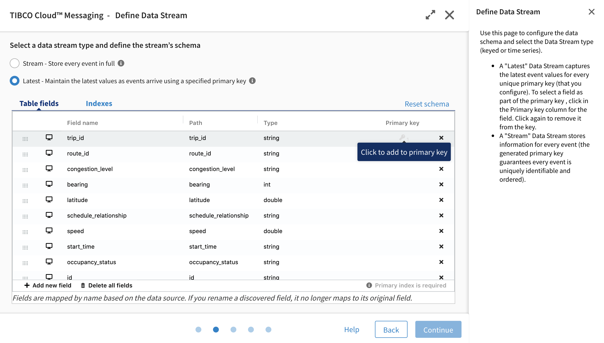
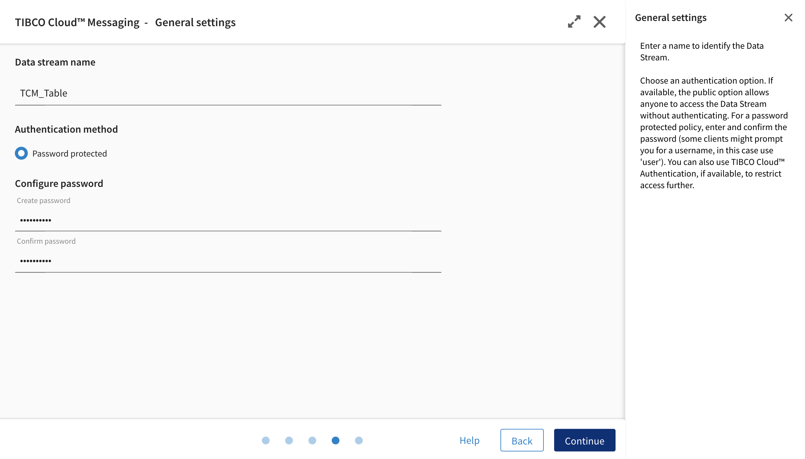
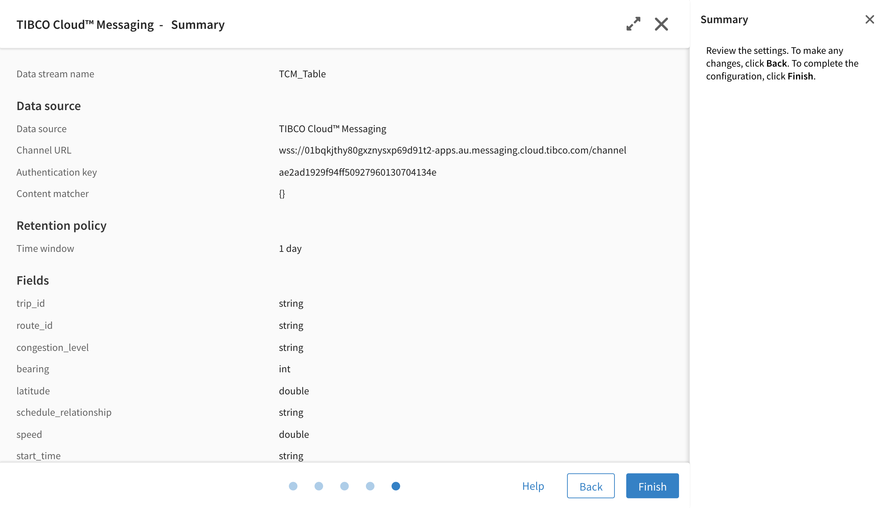

TIBCO ANZ Solution Engineering

Date: December 2020

## Installation and configuration
#### Download this github respository to your local file system
[Real-Time Public Transport Accelerator-Cloud Version](https://github.com/tibco-anz/gtfsSydBusAccelerator)

#### Install Flogo extension
  - Login to TIBCO Cloud (https://cloud.tibco.com/) (sign up trial option is also avaialble).
  - In the capabilities page, Select **Integration**.
  - Select **Integration Apps**.
  - You are now in TIBCO Integration Integration.
  - Select menu items **Environment & Tools**.
  - Under Connector Management & Extensions section, Select **Extensions**.
  - Under Extensions, Select the orange **Upload** button.
  - In the dialog box, select "Browse from file system".
  - In the file dialog box,
** , enter https://github.com/tibco-anz/gtfsSydBusAccelerator/edit/main/resources/TCI-flogo/cl_util.zip and select **Import** button
  - Click the **Done** button to complete import.

  

#### Create Control Table
Control table is used by the cl_SydBusDemo_Run control app to ensure the next job (to extract GTFS and publish to eFTL) won’t be started until the current job is completed.

In any supported cloud hosted databases such as MySQL, Postgre etc, create GTFSBusPosCtrl table schema with the following columns:

**Use the following SQL statement to create database and the control table**:
CREATE DATABASE `GTFSControlDB` /*!40100 DEFAULT CHARACTER SET utf8mb4 COLLATE utf8mb4_0900_ai_ci */ /*!80016 DEFAULT ENCRYPTION='N' */;

CREATE TABLE `GTFSBusPosCtrl` (
  `ReferenceID` varchar(45) DEFAULT NULL,
  `JobDate` datetime DEFAULT NULL,
  `BatchId` bigint(10) DEFAULT NULL,
  `Status` varchar(45) DEFAULT NULL,
  UNIQUE KEY `ReferenceID_UNIQUE` (`ReferenceID`)
) ENGINE=InnoDB DEFAULT CHARSET=utf8mb4 COLLATE=utf8mb4_0900_ai_ci;

**Insert an initial record which will facilitate the start running of the control flow**: 
Example:
insert into GTFSControlDB.GTFSBusPosCtrl (BatchId, Status) values (2,"Started") where ReferenceID="'b6dbc99c-9414-4704-8d71-2575b955c081'";

**Create a TCI database connection cl_GTFSControl to access this table**:
Example:

#### Import Flogo Apps
  - Skip the following steps if you are already in **TIBCO Cloud Integration**.
    - Login to TIBCO Cloud (https://cloud.tibco.com/) (sign up trial option is also avaialble).
    - In the capabilities page, Select **Integration**.
    - Select **Integration Apps**.
  - You are now in TIBCO Integration Integration.

  - Select menu items **Apps**.
  - Under Apps, Select the blue **Create/Import** button.
  - In the dialog box, select **Flogo**, select **Create New App**.
  - Select **Import App** button.
  - In the Import App dialog box, select **browse to upload**.
  - Import **cl_Publish_eFTL** app  
    - In the file dialog box, 
    - select "../gtfsSydBusAccelerator/resources/cl_Publish_eFTL.json".
    - Select the **Upload** button.
    - Ignore the warning message and select **Done**
  - Import **cl_SydBusDemo_PublishGTFS** app
    - Repeat the above steps and select "../gtfsSydBusAccelerator/resources/cl_SydBusDemo_PublishGTFS.json".
  - Import **cl_SydBusDemo_Run** app
    - Repeat the above steps and select "../gtfsSydBusAccelerator/resources/cl_SydBusDemo_Run.json".
    
**Notes**:
The following tasks will be required to ensure end to end process will be running successfully in your environment:
  - Set app visibility to Private for cl_Publish_eFTL and cl_SydBusDemo_PublishGTFS to enable Cloud Mesh discovery for these apps.
  - Re-configure the activities calling the above cloud mesh enabled apps.
  - For cl_SydBusDemo_PublishGTFS, change/set the value of the authentication key to Transport for NSW Open Data hub. 
  - For cl_Publish_eFTL, change/set the value of the authentication key to the eFTL server.
  - Matcher value for messages publishing shall be changed if the same eFTL server is used in your new environment to avoid conflict.
  - For cl_SydBusDemo_Run, update the activities which have reference to the database connection to the control table.

### Configure TIBCO Cloud Messaging
Start eFTL server if it is not running

### Configure TIBCO Cloud Data Streams
 

##### Sign up for TIBCO Cloud Data Streams trial

  - TIBCO Cloud Data Streams software brings the power of real-time analytics to the cloud. It is TIBCO's zero-install, browser-based, cloud-based, wizard-driven, real-time streaming business intelligence (BI) and analytics platform.

  - You can try out TIBCO Cloud Data Streams for free for 30 days. With your trial, you get both TIBCO Cloud Data Streams and a TIBCO Cloud Spotfire trial. You can share your streaming analysis with your team as your free trial includes 2 Analyst, 2 Business Author, and 2 Consumer roles for TIBCO Spotfire.

  - Click here for more information: https://community.tibco.com/wiki/tibco-cloud-data-streams-trial-toolkit

##### Configure Cloud Data Streams to connect to TCM - TIBCO Cloud Messaging

  - Login to https://account.cloud.tibco.com/

  - Select the Oregon Region

  

  - Click on **Analytics**

  

  - Click on **Data Streams**

  

  - This is the Cloud Data Streams home page. Since we are creating a new connection to TIBCO Cloud Messaging, click on **Create new**

  

  - TIBCO Cloud Data Streams supports connecting to open source messaging frameworks like Kafka and MQTT. For this demo, we are going to use TIBCO Cloud Messaging as our streaming data source. Click on **TIBCO Cloud Messaging** and **Continue**.

  

  - The wizard will automatically discover TCM channels that are running within the same region of your TIBCO Cloud account. If TIBCO Cloud Messaging is running in a different region then you need to click **other channel** and fill in the TCM **channel URL** and **authentication key** that is provided during the configuration of TCM. Click **Continue**.

  

  - Here we can leave the content matcher to the default. This setting is only required if you are sending multiple different types of messages in TCM. Click **Continue**.

  

  - Cloud Data Streams will automatically detect the schema of the messages sent by TCI.

  

  - We only need to show in Spotfire the latest relevant data for the buses. Select **Latest** as the data stream type and set **trip_id** as the primary key. Click **Continue**.

  

  - Now specify the **data stream name** and **password**. You will need this password when establishing a connection from TIBCO Cloud Spotfire. Click **Continue**.

  

  - Finally this will lead us to the summary page. Click **Finish**.

  

### Configure TIBCO Cloud Spotfire

  - Download [Spotfire Cloud Analyst](http://mkto-sj140009.com/yHvBFVqw0V0OQCx1EH00100). Login using your TIBCO Cloud account when required.
