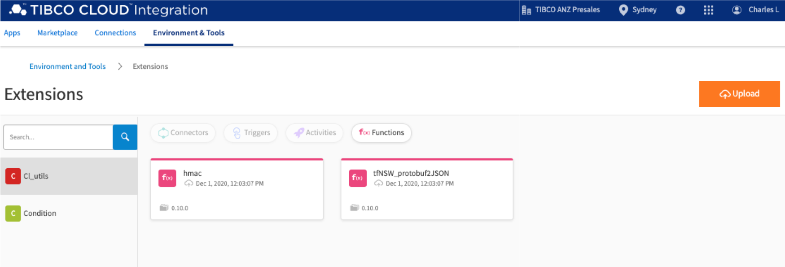
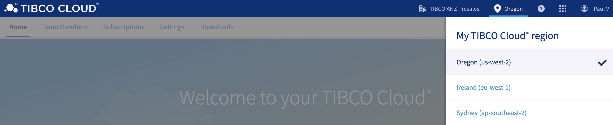
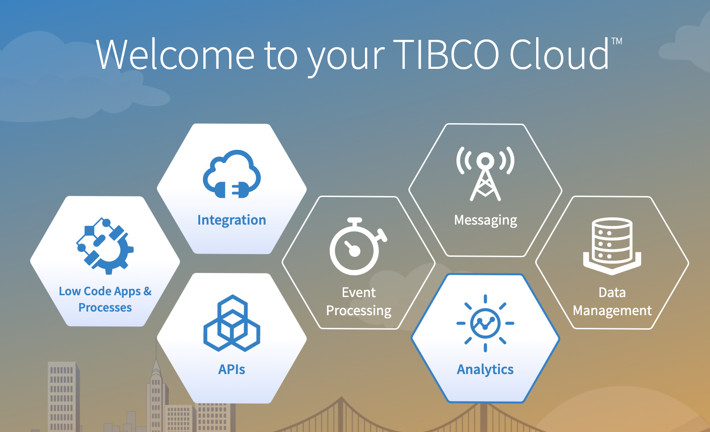
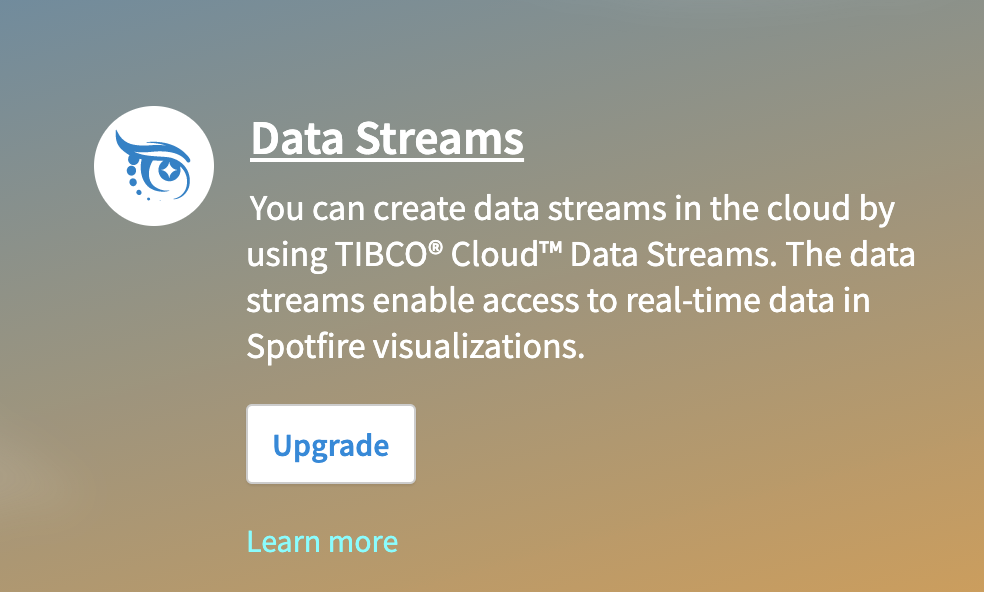
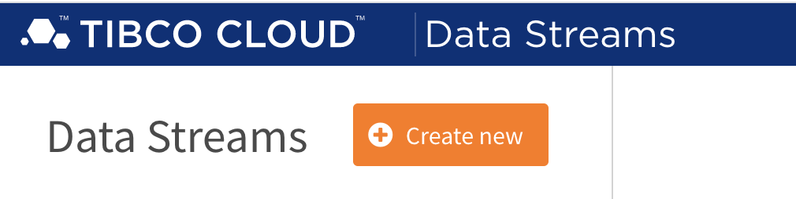
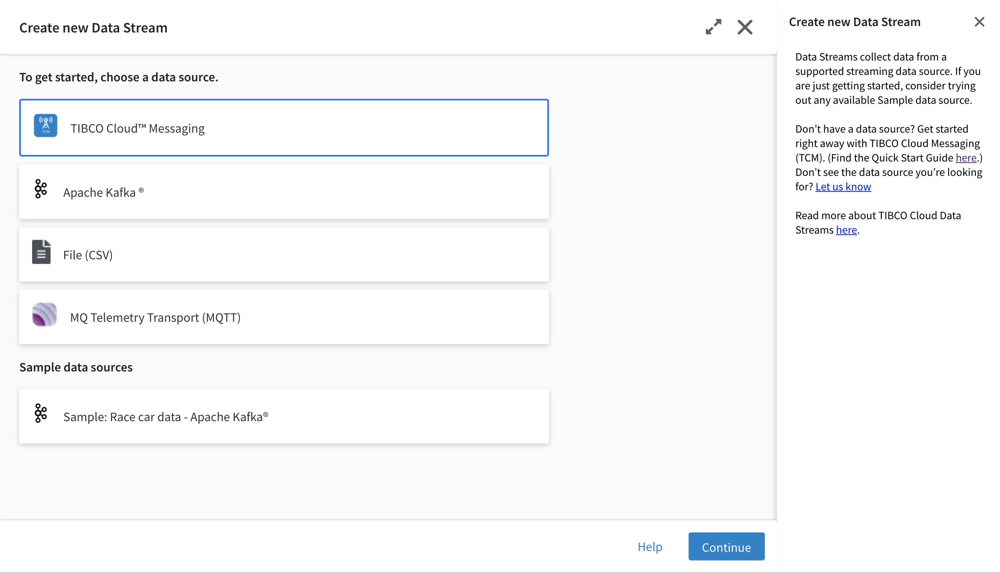
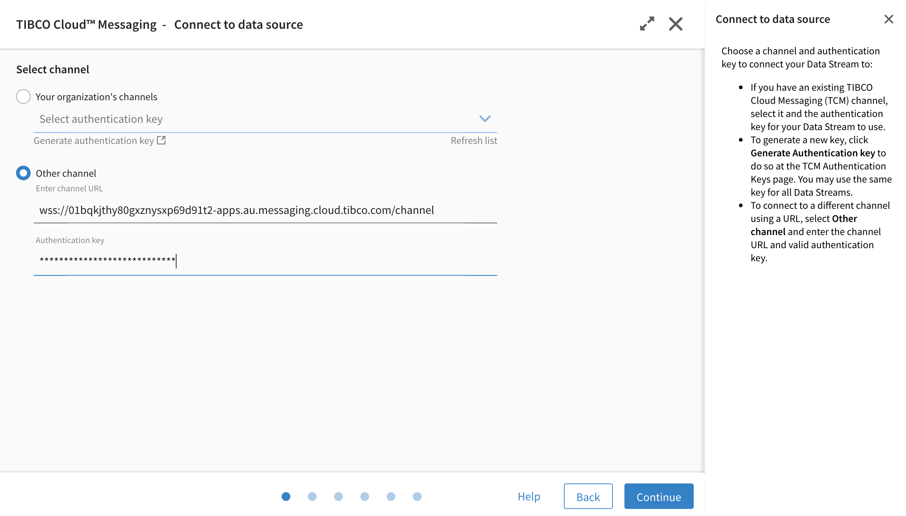

TIBCO ANZ Solution Engineering

Date: December 2020

## Installation and configuration
#### Download this github respository to your local file system

#### Install Flogo extension
  - Login to TIBCO Cloud (https://cloud.tibco.com/) (sign up trial option is also avaialble).
  - In the capabilities page, Select **Integration**.
  - Select **Integration Apps**.
  - You are now in TIBCO Integration Integration.
  - Select menu items **Environment & Tools**.
  - Under Connector Management & Extensions section, Select **Extensions**.
  - Under Extensions, Select the orange **Upload** button.
  - In the dialog box, select "Browse from file system".
  - In the file dialog box,
** , enter https://github.com/tibco-anz/gtfsSydBusAccelerator/edit/main/resources/TCI-flogo/cl_util.zip and select **Import** button
  - Click the **Done** button to complete import.

  

#### Import Flogo flow
  - Skip the following steps if you are already in **TIBCO Cloud Integration**.
  - Login to TIBCO Cloud (https://cloud.tibco.com/) (sign up trial option is also avaialble).
  - In the capabilities page, Select **Integration**.
  - Select **Integration Apps**.
  - You are now in TIBCO Integration Integration.

  - Select menu items **Apps**.
  - Under Apps, Select the blue **Create/Import** button.
  - In the dialog box, select **Flogo**, select **Create New App**.
  - Select **Import App** button.
  - In the Import App dialog box, select **browse to upload**.
  - In the file dialog box, select "../gtfsSydBusAccelerator/resources/flogo.json".
  - Select the **Upload** button.
  - Ignore the warning message and select **Done**

### Configure TIBCO Cloud Messaging

### Configure TIBCO Cloud Data Streams
 

##### Sign up for TIBCO Cloud Data Streams trial

  - TIBCO Cloud Data Streams software brings the power of real-time analytics to the cloud. It is TIBCO's zero-install, browser-based, cloud-based, wizard-driven, real-time streaming business intelligence (BI) and analytics platform.

  - You can try out TIBCO Cloud Data Streams for free for 30 days. With your trial, you get both TIBCO Cloud Data Streams and a TIBCO Cloud Spotfire trial. You can share your streaming analysis with your team as your free trial includes 2 Analyst, 2 Business Author, and 2 Consumer roles for TIBCO Spotfire.

  - Click here for more information: https://community.tibco.com/wiki/tibco-cloud-data-streams-trial-toolkit

##### Configure Cloud Data Streams to connect to TCM - TIBCO Cloud Messaging

  - Login to https://account.cloud.tibco.com/

  - Select the Oregon Region
  

  - Click on **Analytics**
  
  - Click on **Data Streams**
  
  - This is the Cloud Data Streams home page. Since we are creating a new connection to TIBCO Cloud Messaging, click on **Create new**
  
  - TIBCO Cloud Data Streams supports connecting to open source messaging frameworks like Kafka and MQTT. For this demo, we are going to use TIBCO Cloud Messaging as our streaming data source. Click on **TIBCO Cloud Messaging** and **continue**.
  
  - The wizard will automatically discover TCM channels that are running within the same region of your TIBCO Cloud account. If TIBCO Cloud Messaging is running in a different region then you need to click **other channel** and fill in the TCM **channel URL** and **authentication key** that is provided during the configuration of TCM.
  
  - Here we can leave the content mat

### Configure TIBCO Cloud Spotfire
